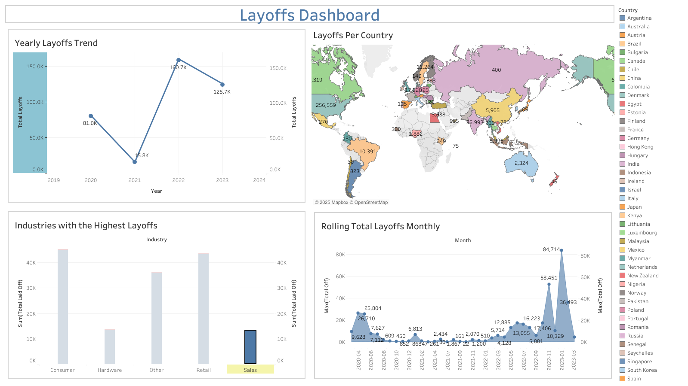

# Layoffs Analysis using SQL


## 🖼️ Dashboard Preview  


## Overview

This project explores global layoffs data using SQL, focusing on data cleaning and exploratory data analysis (EDA). By leveraging **Common Table Expressions (CTEs)** and **window functions**, I analyzed trends in layoffs across industries, companies, and countries. The insights derived can help understand patterns in workforce reductions over time.

## Dataset

The analysis is based on a layoffs dataset containing the following fields:

- **Company** – Name of the company
- **Industry** – Sector in which the company operates
- **Location** – City and country of the company’s headquarters
- **Total Laid Off** – Number of employees affected
- **Percentage Laid Off** – Proportion of workforce reduced
- **Date** – Date of layoffs
- **Stage** – Growth stage of the company
- **Country** – Country of operation
- **Funds Raised (in millions)** – Total funds raised by the company

## SQL Techniques Used for cleaning data
The following steps are implemented in the SQL process:

### 1. **Finding and deleting duplicates using CTE and Window Function**
   A duplicate of the `layoffs` table is created to work with in isolation while preserving the original dataset.
   ```sql
   CREATE TABLE layoffs_dup AS
   SELECT * FROM layoffs;
  ```
Insert all data from layoffs table into the duplicate table
```sql
INSERT INTO layoffs_dup
SELECT * FROM layoffs;
```
 Use a CTE (Common Table Expression) to find duplicates based on specific columns
 ```sql
WITH cte_dup AS (
    SELECT *,
           ROW_NUMBER() OVER (
               PARTITION BY company, location, industry, total_laid_off, percentage_laid_off, 
                            `date`, stage, country, funds_raised_millions
           ) AS row_num
    FROM layoffs_dup
)
```
 Select rows where the row number is greater than 1 (i.e., duplicates)
 ```sql
SELECT * 
FROM cte_dup
WHERE row_num > 1;
```
Create a new table with the same structure as layoffs_dup but with an additional row_num column
```sql
CREATE TABLE `layoffs_dup2` (
  `company` TEXT,
  `location` TEXT,
  `industry` TEXT,
  `total_laid_off` INT DEFAULT NULL,
  `percentage_laid_off` TEXT,
  `date` TEXT,
  `stage` TEXT,
  `country` TEXT,
  `funds_raised_millions` INT DEFAULT NULL,
  `row_num` INT
) ENGINE=InnoDB DEFAULT CHARSET=utf8mb4 COLLATE=utf8mb4_0900_ai_ci
```
Insert data from layoffs_dup into layoffs_dup2 with the row_number calculation for duplicates
```sql
INSERT INTO layoffs_dup2
SELECT *,
       ROW_NUMBER() OVER (
           PARTITION BY company, location, industry, total_laid_off, percentage_laid_off, 
                        `date`, stage, country, funds_raised_millions
       ) AS row_num
FROM layoffs_dup;
```
Delete duplicate rows (where row_num > 1) from layoffs_dup2
```sql
DELETE FROM layoffs_dup2
WHERE row_num > 1;
```
### 2. **Standardizing the data**
deleting unwanted whitespace from company column
``sql
select company, trim(company)
from layoffs_dup2;
```
 updating the comapny column by removing unwanted white space
```sql
update layoffs_dup2
set company= trim(company);
```
checking if whitespace is removed
```sql
select company
 from layoffs_dup2;
```
identifying potential inconsistencies in the industry names by retrieving a distinct list and ordering it alphabetically for easier comparison.
```sql
select distinct industry from layoffs_dup2
order by 1;
```
checking for crypto because there are two companies named Crypto Currency and Crypto
```sql
SELECT * 
FROM layoffs_dup2
WHERE industry LIKE '%Crypto%';
```
this query helps standardize the industry column by ensuring that any value containing “Crypto” is uniformly labeled as "Crypto."
```sql
update layoffs_dup2
set industry='Crypto'
WHERE industry LIKE '%Crypto%';
```
checking if there is anything wrong with the country column like typo or unwanted character 
```sql
select distinct country
from layoffs_dup2;

```
removing (.)  that appears at the end of country name (United States.)
```sql
select distinct trim(trailing '.' from country)
from layoffs_dup2
order by 1;
```
updating the table with respect to above querey
```sql
update layoffs_dup2
set country=trim(trailing '.' from country);
```
changing date data type from text to date
```sql
select `date`,
str_to_date(`date`, '%m/%d/%Y')
from layoffs_dup2;
```
updating the table with above querey
```sql
update layoffs_dup2
set `date`=str_to_date(`date`, '%m/%d/%Y');
```
altering the table with new data type
```sql
alter table layoffs_dup2
CHANGE `date` `date` DATE;
```
### 3. **Dealing with null and blank values**
hanging value to NULL if there are blanks in the table
```sql
update layoffs_dup2
set industry=NULL
where industry='';
```
if there are blank values in the location for the same company in the same location then updating the blank values with the location
```sql
select *
from layoffs_dup2 t1
join layoffs_dup2 t2
on t1.company=t2.company
and t1.location=t2.location
where t1.industry is null 
and t2.industry is not null;
```
updating the table with the above querey
```sql
update layoffs_dup2 t1
join layoffs_dup2 t2
	on t1.company=t2.company
    and t1.location=t2.location
    set t1.industry=t2.industry
    where t1.industry is null 
and t2.industry is not null;
```
### 4. **Dropping and deleting unwanted columns for my analysis**
if total laid off and percentage laid off column is null then i don't need that for my analysis
```sql
select * from 
layoffs_dup2
where total_laid_off is null and percentage_laid_off is null;

```
deleting the null total laid off and percentage laid off column
```sql
delete
from layoffs_dup2
where  total_laid_off is null and percentage_laid_off is null;
```
finally dropping the row_num column that i used to delete duplicate values
```sql
alter table layoffs_dup2
drop column row_num;
```

## SQL Techniques Used for exploring data

1. **Understanding Layoff Severity:**

   - Identified the maximum and minimum percentage of layoffs to assess the severity.

   ```sql
   SELECT MAX(percentage_laid_off), MIN(percentage_laid_off)
   FROM layoffs_dup2;
   ```

2. **Top 5 Industries with the Highest Layoffs:**

   - Summarized total layoffs by industry and identified the most affected sectors.

   ```sql
   SELECT industry, SUM(total_laid_off)
   FROM layoffs_dup2
   GROUP BY industry
   ORDER BY MAX(total_laid_off) DESC
   LIMIT 5;
   ```

3. **Companies That Shut Down:**

   - Queried companies with a 100% layoff rate, indicating complete shutdowns.

   ```sql
   SELECT company
   FROM layoffs_dup2
   WHERE percentage_laid_off = 1;
   ```

4. **Most Affected Locations:**

   - Aggregated total layoffs by country to highlight the most impacted regions.

   ```sql
   SELECT country, SUM(total_laid_off)
   FROM layoffs_dup2
   GROUP BY country
   ORDER BY MAX(total_laid_off) DESC;
   ```

5. **Layoffs in the Food Industry:**

   - Analyzed which country experienced the most food industry layoffs.

   ```sql
   SELECT industry, country, SUM(total_laid_off)
   FROM layoffs_dup2
   GROUP BY industry, country
   HAVING industry = 'Food'
   ORDER BY SUM(total_laid_off) DESC;
   ```

6. **Peak Year for Food Industry Layoffs:**

   - Identified the year with the highest percentage of food industry layoffs.

   ```sql
   SELECT YEAR(`date`) AS layoff_year, SUM(percentage_laid_off) AS Yearly_Percentage
   FROM layoffs_dup2
   WHERE industry = 'Food'
   GROUP BY layoff_year
   ORDER BY Yearly_Percentage DESC
   LIMIT 1;
   ```

7. **Rolling Total of Layoffs per Month:**

   - Used window functions to compute a rolling total of layoffs for each month.

   ```sql
   WITH rolling_cte AS (
       SELECT SUBSTRING(`date`, 1, 7) AS `MONTH`,
       SUM(total_laid_off) OVER(
           PARTITION BY SUBSTRING(`date`, 1, 7)
       ) AS total_off
       FROM layoffs_dup2
       WHERE SUBSTRING(`date`, 1, 7) IS NOT NULL
   )
   SELECT `MONTH`, MAX(total_off)
   FROM rolling_cte
   GROUP BY `MONTH`
   ORDER BY `MONTH` ASC;
   ```

8. **Company Layoffs per Year:**

   - Tracked yearly layoffs per company using window functions.

   ```sql
   WITH company_layoff AS (
       SELECT company, YEAR(`date`) AS `YEAR`,
       SUM(total_laid_off) OVER(
           PARTITION BY company, YEAR(`date`)
       ) AS company_total
       FROM layoffs_dup2
   )
   SELECT company, `YEAR`, company_total
   FROM company_layoff
   GROUP BY 1, 2, 3
   ORDER BY `YEAR` ASC;
   ```

## Key Insights

- **Tech and finance sectors** experienced the highest layoffs.
- **Startups and late-stage companies** were more prone to workforce reductions.
- Layoff trends correlate with **funding downturns** and global economic shifts.
- **Certain countries and industries** faced a disproportionate impact.


## How to Use

1. Clone the repository:
   ```bash
   git clone https://github.com/yourusername/sql-layoffs-analysis.git
   ```
2. Open the SQL script in your preferred SQL environment.
3. Run queries in sequence to clean and analyze the data.

## Tool Used

- **SQL  (SQL Server)**
  

This project is part of my data analysis portfolio, showcasing my SQL expertise in handling real-world datasets.

